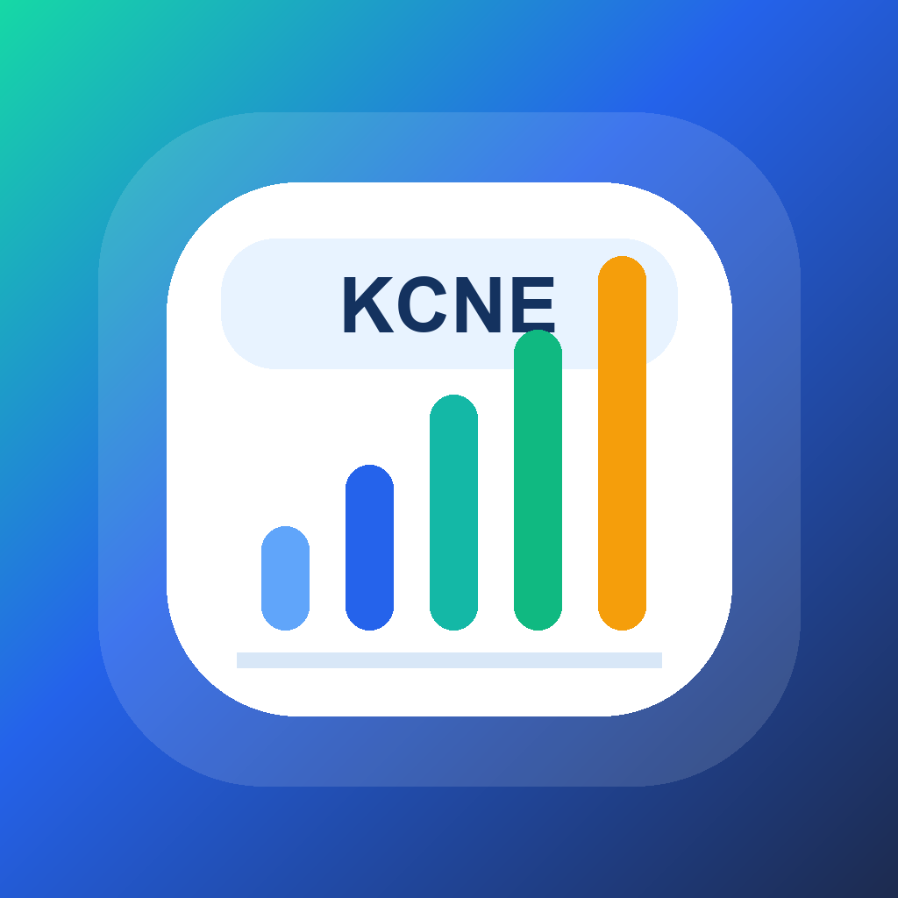
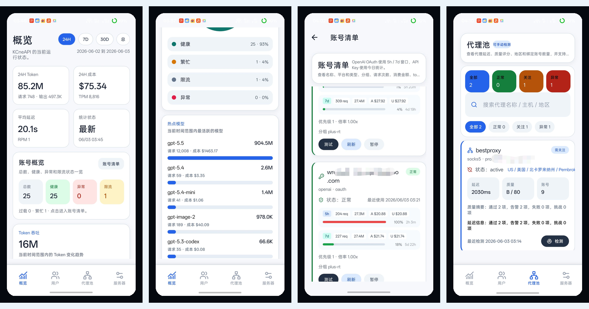
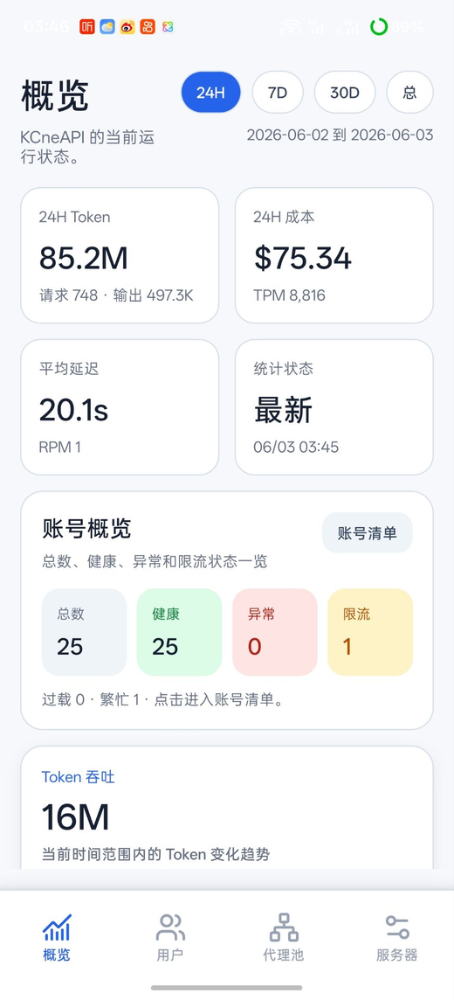
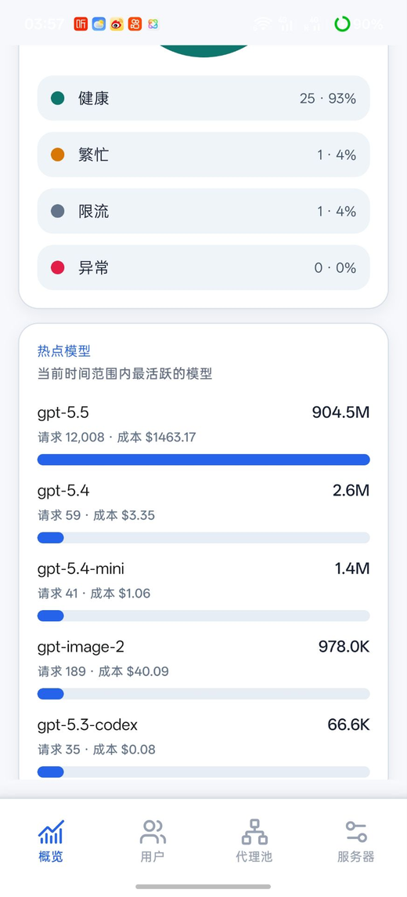
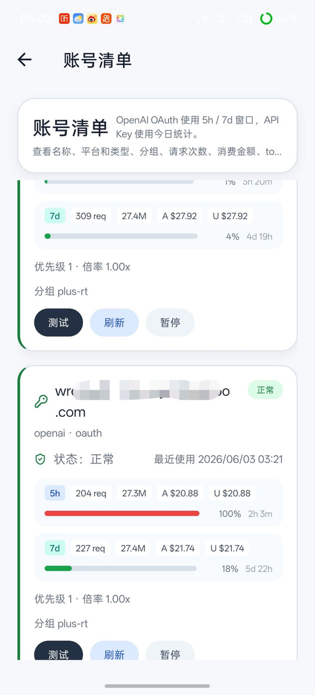
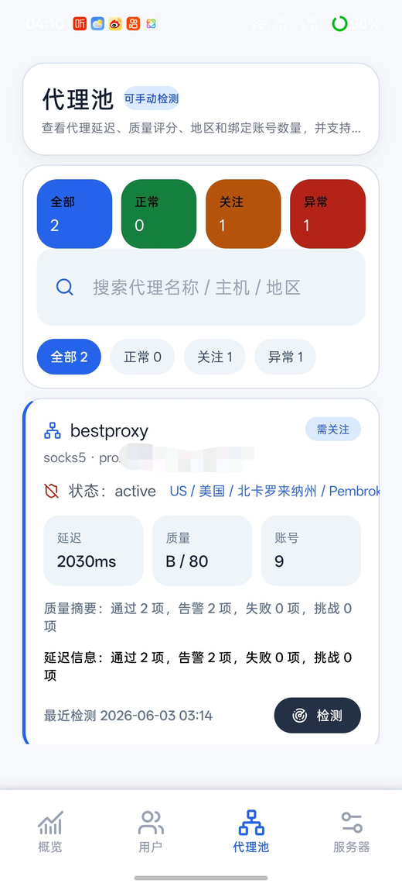
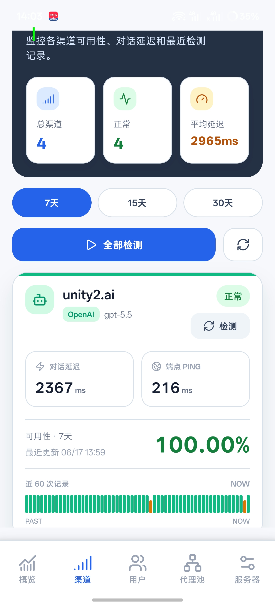

<p align="center">
  
</p>

<h1 align="center">KCNE 控制台</h1>

<p align="center">
  基于 sub2api-mobile 二次开发的 Sub2API 移动端管理控制台 / A customized Sub2API mobile admin console based on sub2api-mobile
</p>

<p align="center">
  <a href="#简体中文">简体中文</a> · <a href="#english">English</a>
</p>

<p align="center">
  
</p>

> Screenshots are captured from a real Android device and redacted before publishing.
>
> 截图来自真实 Android 设备，发布前已做必要脱敏。

## 简体中文

### 项目简介

KCNE 控制台是基于 `sub2api-mobile` 的二次开发版本，把 Sub2API 管理后台搬到手机上，并针对 KCNE 的移动管理工作流做了界面和功能增强。它提供运行概览、渠道状态、账号健康、额度窗口、代理池质量、用户 / API Key 管理和服务器配置等能力。

本仓库是面向 KCNE 使用场景维护的 fork / 二开版本，上游项目仍归原作者所有。

它适合需要随时查看服务状态的运营者：快速扫一眼用量、定位异常账号、手动检测账号或渠道，并在多个管理服务器之间切换，不必频繁打开网页后台。

### 功能亮点

- **实时概览**：支持 24H / 7D / 30D / 总数据范围，展示 Token 吞吐、成本、延迟、RPM/TPM 和账号健康。
- **渠道状态监控**：展示可用率窗口、对话延迟、端点 Ping、最近 60 次检测记录，并支持一键手动检测。
- **账号清单对齐网页后台**：支持分组筛选、状态筛选、请求排序、OAuth 5h / 7d 窗口和 API Key 日用量统计。
- **手动账号检测**：按网页后台流程加载可用模型、选择默认模型、调用流式检测接口，并显示实时成功 / 失败反馈。
- **代理池管理**：支持健康筛选、质量检测、延迟 / 评分、地区信息和手动检测。
- **管理资源**：覆盖用户、API Key、分组、余额、服务器状态和多服务器配置。
- **移动端优先 UI**：紧凑卡片、大触控区域、底部导航和适合公开展示的脱敏截图。

### 截图

<p align="center">
  
  
  
  
  
</p>

### 技术栈

- Expo SDK 54
- React Native 0.81
- React 19
- Expo Router
- TanStack Query
- Valtio
- TypeScript

### 环境要求

- Node.js 20+
- npm 10+
- Android Studio / Android SDK，用于 Android 原生构建
- 可选：EAS CLI，用于云构建和 OTA 更新

### 快速开始

安装依赖：

```bash
npm ci
```

本地启动：

```bash
npm run start
```

常用目标：

```bash
npm run android
npm run ios
npm run web
```

### 构建与发布

EAS 构建脚本：

```bash
npm run eas:build:development
npm run eas:build:preview
npm run eas:build:production
```

OTA 更新脚本：

```bash
npm run eas:update:preview -- "your message"
npm run eas:update:production -- "your message"
```

更多发布说明见：[docs/EXPO_RELEASE.md](docs/EXPO_RELEASE.md)

GitHub Actions Android 构建：

- Workflow：`.github/workflows/eas-build.yml`
- 触发方式：**Actions -> EAS Build -> Run workflow**
- 参数：`profile=preview`，`platform=android`
- 要求：仓库 Secret 中配置 `EXPO_TOKEN`
- 下载：构建完成后打开运行记录的 **Summary**，使用 `ANDROID download` 链接下载。

### 项目结构

```txt
app/                 Expo Router 路由和页面
src/components/      可复用 UI 组件
src/services/        Admin API 请求层
src/store/           全局配置和账号状态（Valtio）
src/lib/             工具函数、query client、fetch helper
docs/                运行文档和脱敏截图
server/              本地 Express 代理服务
```

### 安全说明

- `docs/screenshots` 内截图应保持脱敏，不应包含真实账号标识、代理端点、Admin Token 或服务器密钥。
- Web 构建刻意避免持久化保存 `adminApiKey`。
- 原生平台继续使用安全存储语义。
- 负责任披露请查看 [SECURITY.md](SECURITY.md)。

### 贡献

请阅读 [CONTRIBUTING.md](CONTRIBUTING.md) 和 [CODE_OF_CONDUCT.md](CODE_OF_CONDUCT.md)。

### 许可证

本项目基于 MIT License 发布，详见 [LICENSE](LICENSE)。

## English

### Overview

KCNE Console is a customized fork of `sub2api-mobile`. It brings the Sub2API admin workflow onto a phone and adds UI and workflow refinements for KCNE operations: operational dashboards, channel status, account health, usage windows, proxy quality, user/API key management, and server status in one native-feeling interface.

This repository is a KCNE-oriented second-development fork. The upstream project remains owned by its original author.

It is designed for operators who need to glance at live usage, spot unhealthy accounts, refresh or test accounts and channels, and switch between admin servers without opening the web dashboard.

### Highlights

- **Live dashboard** with 24H / 7D / 30D / total ranges, token throughput, cost, latency, RPM/TPM, and account health summaries.
- **Channel status monitoring** with availability windows, chat latency, endpoint ping, recent 60-check history, and one-tap manual detection.
- **Account list aligned with the web admin view**, including group filters, status filters, request sorting, OAuth 5h / 7d windows, and API Key daily usage stats.
- **Manual account testing** that follows the web admin flow: load available models, pick a default model, call the streaming test endpoint, and show live pass/fail feedback.
- **Proxy pool management** with health filters, quality checks, latency/score views, region metadata, and manual detection support.
- **Admin resources** for users, API keys, groups, balances, server health, and multi-server configuration.
- **Mobile-first UI** with compact cards, large touch targets, bottom navigation, and redacted-safe public screenshots.

### Screenshots

<p align="center">
  
  
  
  
  
</p>

### Tech Stack

- Expo SDK 54
- React Native 0.81
- React 19
- Expo Router
- TanStack Query
- Valtio
- TypeScript

### Prerequisites

- Node.js 20+
- npm 10+
- Android Studio / Android SDK for native Android builds
- Optional: EAS CLI for cloud builds and OTA updates

### Getting Started

Install dependencies:

```bash
npm ci
```

Run locally:

```bash
npm run start
```

Common targets:

```bash
npm run android
npm run ios
npm run web
```

### Build & Release

EAS scripts:

```bash
npm run eas:build:development
npm run eas:build:preview
npm run eas:build:production
```

OTA update scripts:

```bash
npm run eas:update:preview -- "your message"
npm run eas:update:production -- "your message"
```

Additional release notes: [docs/EXPO_RELEASE.md](docs/EXPO_RELEASE.md)

GitHub Actions Android build:

- Workflow: `.github/workflows/eas-build.yml`
- Trigger: **Actions -> EAS Build -> Run workflow**
- Inputs: `profile=preview`, `platform=android`
- Requirement: repository secret `EXPO_TOKEN`
- Download: after completion, open the run **Summary** and use the `ANDROID download` link.

### Project Structure

```txt
app/                 Expo Router routes/screens
src/components/      Reusable UI components
src/services/        Admin API request layer
src/store/           Global config/account state (Valtio)
src/lib/             Utilities, query client, fetch helpers
docs/                Operational docs and redacted screenshots
server/              Local Express proxy for admin APIs
```

### Security Notes

- Screenshots in `docs/screenshots` are redacted and should not contain live account identifiers, proxy endpoints, admin keys, or server secrets.
- Web builds are intentionally configured to avoid persistent storage of `adminApiKey`.
- Native platforms continue to use secure storage semantics.
- For responsible disclosure, see [SECURITY.md](SECURITY.md).

### Contributing

Please read [CONTRIBUTING.md](CONTRIBUTING.md) and [CODE_OF_CONDUCT.md](CODE_OF_CONDUCT.md).

### License

This project is licensed under the MIT License. See [LICENSE](LICENSE).
